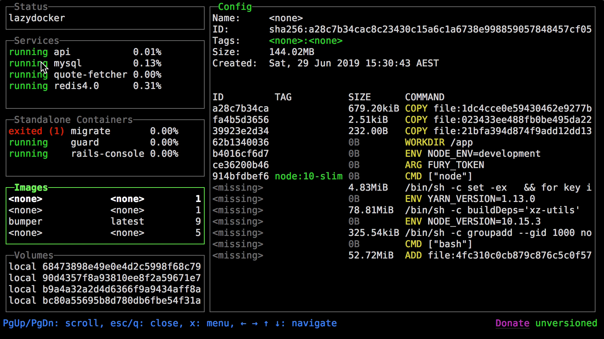
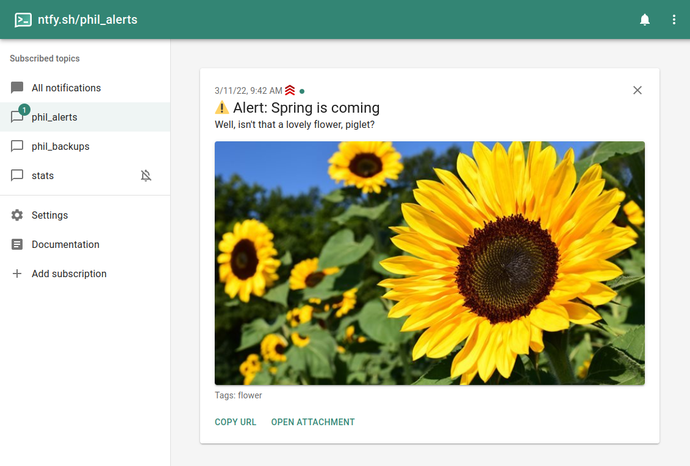

# cocinfo

## 2023

### 0505

- [restic/restic](https://github.com/restic/restic):Fast, secure, efficient backup program, remote backup.
- [syncthing/syncthing](https://github.com/syncthing/syncthing):Syncthing is a continuous file synchronization program. It synchronizes files between two or more computers
- [nektos/act](https://github.com/nektos/act):Run your GitHub Actions locally 🚀

- [voicepaw/so-vits-svc-fork](https://github.com/voicepaw/so-vits-svc-fork)：so-vits-svc fork with realtime support, improved interface and more features.
- [svc-develop-team/so-vits-svc](https://github.com/svc-develop-team/so-vits-svc)

- [Hugging Face](https://huggingface.co/models?search=so-vits-svc)

- [CVI-SZU/Linly](https://github.com/CVI-SZU/Linly):Chinese-LLaMA基础模型；ChatFlow中文对话模型；NLP预训练/指令微调数据集
- [Agent-LLM (Large Language Model)](https://github.com/Josh-XT/Agent-LLM):An Artificial Intelligence Automation Platform. AI Instruction management from various providers, has an adaptive memory, and a versatile plugin system with many commands including web browsing. Supports many AI providers and models and growing support every day.

- [卡片笔记写作法](https://book.douban.com/subject/35503571/):本书是该系统的第一本中文综合指南和说明，本书分为三个部分，第一个部分从写作知识、写作准备、写作能力和注意事项四个角度概述写作的基本问题；第二部分总结了有效写作的四个原则；第三部分是成功写作的六个步骤。详细解释了卡片盒笔记写作法的工作原理和具体写作方法，这一方法可以帮助我们将精力集中在真正重要的事情上——思考、理解和提出新的写作思路，而不用将时间浪费在寻找笔记、资料或参考文献上。

### 0506

- [gitleaks/gitleaks](https://github.com/gitleaks/gitleaks):Gitleaks is a SAST tool for detecting and preventing hardcoded secrets like passwords, api keys, and tokens in git repos. Gitleaks is an easy-to-use, all-in-one solution for detecting secrets, past or present, in your code.
- [cloudquery/cloudquery](https://github.com/cloudquery/cloudquery):CloudQuery is an open-source, high-performance data integration framework built for developers.
- [rancher/rancher](https://github.com/rancher/rancher):Complete container management platform
- [traefik/traefik](https://github.com/traefik/traefik):Traefik (pronounced traffic) is a modern HTTP reverse proxy and load balancer that makes deploying microservices easy. Traefik integrates with your existing infrastructure components (Docker, Swarm mode, Kubernetes, Consul, Etcd, Rancher v2, Amazon ECS, ...) and configures itself automatically and dynamically. Pointing Traefik at your orchestrator should be the only configuration step you need.
- [xtekky/gpt4free](https://github.com/xtekky/gpt4free):decentralising the Ai Industry, just some language model api's...
- [reedmand/semantra](https://github.com/freedmand/semantra):Semantra is a multipurpose tool for semantically searching documents. Query by meaning rather than just by matching text.
- [置身事内](https://book.douban.com/subject/35546622/):这种“混合经济”体系，不是主流经济学教科书中所说的政府和市场的简单分工模式，即政府负责提供公共物品、市场主导其他资源配置；也不是简单的“政府搭台企业唱戏”模式。而是政府及其各类附属机构（国企、事业单位、大银行等）深度参与大多数生产和分配环节的模式。在我国，想脱离政府来了解经济，是不可能的。

### 0509

- [jesseduffield/lazydocker](https://github.com/jesseduffield/lazydocker):A simple terminal UI for both docker and docker-compose, written in Go with the gocui library.

- [binwiederhier/ntfy](https://github.com/binwiederhier/ntfy):Send push notifications to your phone or desktop using PUT/POST

消息队列 + 爬虫 = 最新资讯收集

- [k3s-io/k3s](https://github.com/k3s-io/k3s):Lightweight Kubernetes. Production ready, easy to install, half the memory, all in a binary less than 100 MB
- [appsmithorg/appsmith](https://github.com/appsmithorg/appsmith):Framework to build admin panels, internal tools, and dashboards. Integrates with 15+ databases and any API.

- peek performance: 英文原版的 pdf 找不到 QAQ

### 0510

- [1Panel](https://github.com/1Panel-dev/1Panel):现代化、开源的 Linux 服务器运维管理面板。
- [HttpRouter](https://github.com/julienschmidt/httprouter):A high performance HTTP request router that scales well
- [pgx - PostgreSQL Driver and Toolkit](https://github.com/jackc/pgx):PostgreSQL driver and toolkit for Go
- [expressvpn/lightway-core](https://github.com/expressvpn/lightway-core):Lightway Core is a modern VPN protocol by ExpressVPN, to deliver a VPN experience that’s faster, more secure, and more reliable.
